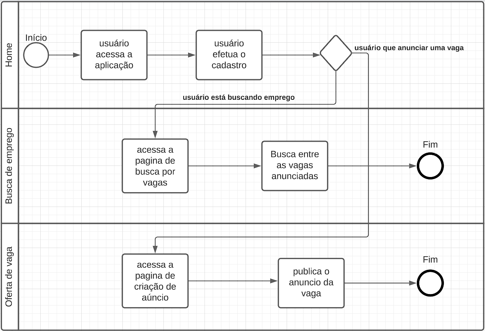

# Especificações do Projeto

A definição exata do problema e os pontos mais relevantes a serem tratados neste projeto foi consolidada com a participação dos usuários em um trabalho de imersão feita pelos membros da equipe a partir da coleta de dados dos usuários. Os detalhes levantados nesse processo foram consolidados na forma de personas e histórias de usuários.

## Personas

|    `Nome`: Juliana Silveira Brancis  | `Profissão`: Desempregada       |     `Idade`: 38 Anos    |
|--------------------|------------------------------------|----------------------------------------|
| | `Motivações`:   Sustento      Experiência profissional          |  `Frustrações`:    Falta de capacitação      Poucas oportunidades na área                       
|  `Hobbies`: |   `História`:  | `Personalidade`:  |
|   Adora assistir filmes    Gosta de passear ao Ar livre   Conhecer lugares novos         | Juliana é assistente administrativa,   que ama sua área   porém tem buscado bicos com objetivo de levantar capital para que possa ajuda-la a abrir seu próprio negócio               | Organizada    Extrovertida    Esfoçada    |

|    `Nome`: Mario José Dantas  | `Profissão`: Desenvolvedor         |     `Idade`: 32 Anos    |
|--------------------|------------------------------------|----------------------------------------|
| | `Motivações`:    Aumentar rendimentos     Criar seu próprio portifolio de trabalhos externos      Conhecimento na área |  `Frustrações`:     Pouco tempo sobrando para trabalhar     Cansaço de trabalhar com tecnologia o dia inteiro    Pressão da paternidade           
|  `Hobbies`: |   `História`:  | `Personalidade`:  |
|   Jogar Games     Ouvir música livre   Conhecer tecnologias novas            | Mario José é um desenvolvedor focado   Mário precisa fazer renda extra pois sua família está crescendo   mario gosta de webdesign e adora programação, está a procura de empregos informais na sua área de atuação.             | Bondoso    Introvertido    Metodico       |

|    `Nome`: Marcelo Belchior Melo  | `Profissão`: Aposentado         |     `Idade`: 70 Anos    |
|--------------------|------------------------------------|----------------------------------------|
| | `Motivações`:     Amor pelos bichos     Distração      Trabalhar por hobby |  `Frustrações`:     Não conseguir emprego no trabalho formal     Idade avançada               
|  `Hobbies`: |   `História`:  | `Personalidade`:  |
|   Ler     Jogos de mesa   Conversar com as pessoas            | Marcelo é um professor aposentado e se sente desmotivado com a sua rotina,  sempre foi uma pessoa ativa que gostou de trabalhar  quer voltar a ser a como antes e usar aprender sobre novas áreas. Ele tem se interessado pela área de pet, e quer aprender a trabalhar cuidando de cachorros.            | Esforçado    Sério    Amante da Natureza       |

|    `Nome`: Luís Antonio Campos  | `Profissão`: Empreendedor       |     `Idade`: 27 Anos    |
|--------------------|------------------------------------|----------------------------------------|
| | `Motivações`:   Busca uma plataforma que possa ajudá-lo a economizar tempo e lidar com tarefas domésticas, permitindo que ele se concentre em seu trabalho      Gerenciar seu tempo de forma eficaz          |  `Frustrações`:    Falta de tempo para realizar tarefas domésticas, o que pode causar acúmulo de tarefas e estresse      Dificuldade em encontrar profissionais confiáveis e de qualidade para serviços gerais, como limpeza e reparos em casa                       
|  `Hobbies`: |   `História`:  | `Personalidade`:  |
|   Assistir séries    Corrida ao ar livre   Ler livros         | Luís é um jovem empreendedor de 27 anos que está construindo sua carreira como freelancer. Ele mora sozinho em um pequeno apartamento e passa a maior parte do tempo trabalhando em projetos para seus clientes. Ele não tem muito tempo livre para fazer tarefas domésticas, como limpeza e compras, e está procurando uma plataforma que possa ajudá-lo a ter mais tempo livre para se concentrar em seu trabalho.               | Comunicativo     Persistente    Determinado    |

|    `Nome`: Clara Rosângela Almada  | `Profissão`: Fotógrafa Profissional       |     `Idade`: 30 Anos    |
|--------------------|------------------------------------|----------------------------------------|
| | `Motivações`:   Expandir seu negócio de fotografia      Atrair mais clientes em potencial       Diversificar seus clientes e tipos de trabalhos          |  `Frustrações`:    Concorrência acirrada no mercado de fotografia      Dificuldade em encontrar novos clientes     Limitações em termos de visibilidade e alcance de sua publicidade                         
|  `Hobbies`: |   `História`:  | `Personalidade`:  |
|   Praticar esportes ao ar livre    Assistir filmes e documentários sobre fotografia   Apreciar a natureza e paisagens         | Clara é uma fotógrafa profissional de 30 anos que está procurando por uma plataforma que possa ajudá-la a promover seus serviços de fotografia para um público mais amplo. Ela precisa de uma plataforma que seja fácil de usar e que possa ajudá-la a se conectar com clientes em potencial que estão interessados em seus serviços de fotografia. Além disso, ela está procurando por uma plataforma que possa fornecer suporte e orientação em relação à promoção e marketing de seus serviços.               | Criativa      Observadora    Autêntica    |

## Histórias de Usuários

Com base na análise das personas forma identificadas as seguintes histórias de usuários:

|EU COMO... `PERSONA`| QUERO/PRECISO ... `FUNCIONALIDADE` |PARA ... `MOTIVO/VALOR`                 |
|--------------------|------------------------------------|----------------------------------------|
|Juliana Brancis    | Encontrar um emprego formal ou informal |  Candidaturas de forma facil |
|Juliana Brancis    | Ser capaz de cadastrar curriculo único | não precisar escrever varios curriculos pra cada vaga |
|Mario Dantas       | Filtrar as vagas por área | Facilitar encontrar vagas especificas   |
|Mario Dantas       | Descrição das vagas | Evitar se inscrever em vagas que não tem perfil  |
|Marcelo Melo  | Interface intuitiva e acessível | Encontrar um bicos voltado aos hobby   |
|Luís Antonio|De profissionais confiáveis e de qualidade para serviços gerais. | Delegar essas tarefas a pessoas experientes e capacitadas, sem precisar lidar com esses problemas sozinho.  |
|Clara Rosângela|Uma plataforma para encontrar novos projetos e oportunidades de trabalho na área de fotografia. | Diversificar meus clientes e projetos, expandir meus negócios e aumentar minha renda.  |

Apresente aqui as histórias de usuário que são relevantes para o projeto de sua solução. As Histórias de Usuário consistem em uma ferramenta poderosa para a compreensão e elicitação dos requisitos funcionais e não funcionais da sua aplicação. Se possível, agrupe as histórias de usuário por contexto, para facilitar consultas recorrentes à essa parte do documento.

## Modelagem do Processo de Negócio 

### Análise da Situação Atual

Atualmente embora venha ocorrendo uma popularização do uso de plataformas online para a busca e oferta de vagas de emprego, as aplicações existentes nesse nicho de mercado em sua maioria são voltadas para empregos formais, assim deixando em aberto boa parte do mercado de empregos informais e alguns seguimentos dos formais que devido a diversos motivos não se adequam as plataformas.

Observado esses nichos que são pouco explorados pelas plataformas existentes, decidimos criar uma aplicação que se encaixa nesse mercado.

### Descrição Geral da Proposta

Nossa aplicação vai atuar onde as presentes no mercado atual tem pouco alcance, colocando o foco principal no mercado de empregos informais, mas mantendo a plataforma aberta também para os formais, facilitando a reunião do trabalhador com o empregador.

### Processo 1 – FUNCIONAMENTO DA PLATAFORMA

Processo básico de funcionamento da plataforma.

## Indicadores de Desempenho

Apresente aqui os principais indicadores de desempenho e algumas metas para o processo. Atenção: as informações necessárias para gerar os indicadores devem estar contempladas no diagrama de classe. Colocar no mínimo 5 indicadores. 

Obs.: todas as informações para gerar os indicadores devem estar no diagrama de classe a ser apresentado a posteriori. 

## Requisitos

As tabelas que se seguem apresentam os requisitos funcionais e não funcionais que detalham o escopo do projeto.

### Requisitos Funcionais

|ID    | Descrição do Requisito  | Prioridade |
|------|-----------------------------------------|----|
|RF-001| A aplicação deverá possuir uma apresentação breve do aplicativo | BAIXA |
|RF-002| A aplicação deverá cadastrar dois tipos de usuários, o contratatante e o contratado | ALTA | 
|RF-003| A aplicação deverá permitir a edição do perfil desses usuários | ALTA | 
|RF-004| A aplicação terá um perfil de usuário para o contratado com suas qualificações e preferências | ALTA | 
|RF-005| A aplicação deverá permitir o contratante criar oportunidades de serviço | ALTA|
|RF-006| A aplicação deverá permitir o contratante selecionar a categoria do serviço em questão.| MEDIA |
|RF-007| A aplicação deverá exibir as especificações de cada serviço aos contratados como VALOR, LOCAL, PERÍODO e FUNÇÃO | ALTA |
|RF-008| A aplicação deve permitir que o contratado canditate-se as oportunidades de serviço | ALTA | 
|RF-009| A aplicação deverá possuir a funcionalidade de busca e filtragem das oportunidades de serviço | BAIXA |
|RF-010| A aplicação deverá sugerir serviços aos contratados baseando-se em seus dados pessoais | MEDIA | 
|RF-011| A aplicação deverá permitir que os usuários tenham as infomações de contato de ambos | ALTA | 
|RF-012| A aplicação deverá permitir que os usuários façam o login e loggout | ALTA |
|RF-013| A aplicação deverá possuir o contratante avaliar o contratado e vice-versa após o serviço | BAIXA |

### Requisitos não Funcionais

|ID     | Descrição do Requisito  |Prioridade |
|-------|-------------------------|----|
|RNF-001| O App deve operar em dispositivos móveis no ANDROID e IOS | ALTA | 
|RNF-002| O App possuirá responsividade para atender os dispositivos móveis | ALTA | 
|RNF-003| O App deve ter bom nível de contraste entre os elementos da tela em conformidade| MÉDIA |
|RNF-004| O App deverá seguir as normas da LGPD| ALTA |
|RNF-005| O App não deve consumir mais que 10GB de memória ao realizar seu download | BAIXA |

Com base nas Histórias de Usuário, enumere os requisitos da sua solução. Classifique esses requisitos em dois grupos:

- [Requisitos Funcionais
 (RF)](https://pt.wikipedia.org/wiki/Requisito_funcional):
 correspondem a uma funcionalidade que deve estar presente na
  plataforma (ex: cadastro de usuário).
- [Requisitos Não Funcionais
  (RNF)](https://pt.wikipedia.org/wiki/Requisito_n%C3%A3o_funcional):
  correspondem a uma característica técnica, seja de usabilidade,
  desempenho, confiabilidade, segurança ou outro (ex: suporte a
  dispositivos iOS e Android).
Lembre-se que cada requisito deve corresponder à uma e somente uma
característica alvo da sua solução. Além disso, certifique-se de que
todos os aspectos capturados nas Histórias de Usuário foram cobertos.

## Restrições

O projeto está restrito pelos itens apresentados na tabela a seguir.

|ID| Restrição                                             |
|--|-------------------------------------------------------|
|01| O projeto deverá ser entregue até o julho 2023 |
|02| Desempenho: Os aplicativos desenvolvidos com React Native podem ter um desempenho inferior em comparação com aplicativos nativos, especialmente em dispositivos mais antigos ou mais lentos. |
|03| Dependência de módulos nativos: Em alguns casos, pode ser necessário desenvolver módulos nativos personalizados para usar recursos específicos do dispositivo ou integrações com outras tecnologias, como câmera, GPS ou Bluetooth. |
|04| Limitações de UI personalizada: O React Native tem algumas limitações na personalização da interface do usuário em comparação com aplicativos nativos, o que pode afetar a aparência e a experiência do usuário. |
|05| Compatibilidade: O React Native pode não ser compatível com todas as versões de sistemas operacionais e dispositivos móveis, o que pode limitar o público do aplicativo. |
|06|  Falta de autenticação: O JSON-Server não oferece autenticação ou proteção de senha, o que pode ser um problema para aplicativos que lidam com dados sensíveis. |
|07| Dados estáticos: O JSON-Server é projetado para lidar com dados estáticos, o que significa que ele não pode manipular dados em tempo real. Se os dados mudarem, será necessário reiniciar o servidor para atualizar os dados. |
|08| Limitação de recursos: O JSON-Server pode lidar com uma quantidade limitada de dados, e se a quantidade de dados for muito grande, pode haver problemas de desempenho. Além disso, o JSON-Server não suporta recursos complexos ou relacionamentos entre recursos. |
|09| Não escalável: O JSON-Server não é escalável e não pode lidar com grandes quantidades de tráfego ou grandes quantidades de dados em tempo real. Se a carga de tráfego for muito alta, o servidor pode falhar ou ficar lento. |

Enumere as restrições à sua solução. Lembre-se de que as restrições geralmente limitam a solução candidata.

## Diagrama de Casos de Uso

Diagrama de casos de uso do app:

# Matriz de Rastreabilidade

A matriz ainda não rastreou todos os artefatos da aplicação pois existem documentações e codificações pendentes.
Assuntos como casos de teste e diagramas ainda não estão previstos nessa versão da matriz, mas serão implementados ao serem criados.

Link da Matriz em excel:
https://github.com/gisellenrosa/BicosMobile/blob/6f5448258fbd96aec8020ff6944cd399171099b8/docs/img/MATRIZ%20DE%20RASTREABILIDADE.xlsx

# Gerenciamento de Projeto

De acordo com o PMBoK v6 as dez áreas que constituem os pilares para gerenciar projetos, e que caracterizam a multidisciplinaridade envolvida, são: Integração, Escopo, Cronograma (Tempo), Custos, Qualidade, Recursos, Comunicações, Riscos, Aquisições, Partes Interessadas. Para desenvolver projetos um profissional deve se preocupar em gerenciar todas essas dez áreas. Elas se complementam e se relacionam, de tal forma que não se deve apenas examinar uma área de forma estanque. É preciso considerar, por exemplo, que as áreas de Escopo, Cronograma e Custos estão muito relacionadas. Assim, se eu amplio o escopo de um projeto eu posso afetar seu cronograma e seus custos.

## Gerenciamento de Tempo

Diagrama de tempo que prevê as tarefas a serem realizadas e seu fluxo no app.

## Gerenciamento de Equipe

O gerenciamento adequado de tarefas contribuirá para que o projeto alcance altos níveis de produtividade. Por isso, é fundamental que ocorra a gestão de tarefas e de pessoas, de modo que os times envolvidos no projeto possam ser facilmente gerenciados. 

Quadro de gerenciamento de tarefas da equipe:

## Gestão de Orçamento

O processo de determinar o orçamento do projeto é uma tarefa que depende, além dos produtos (saídas) dos processos anteriores do gerenciamento de custos, também de produtos oferecidos por outros processos de gerenciamento, como o escopo e o tempo.

